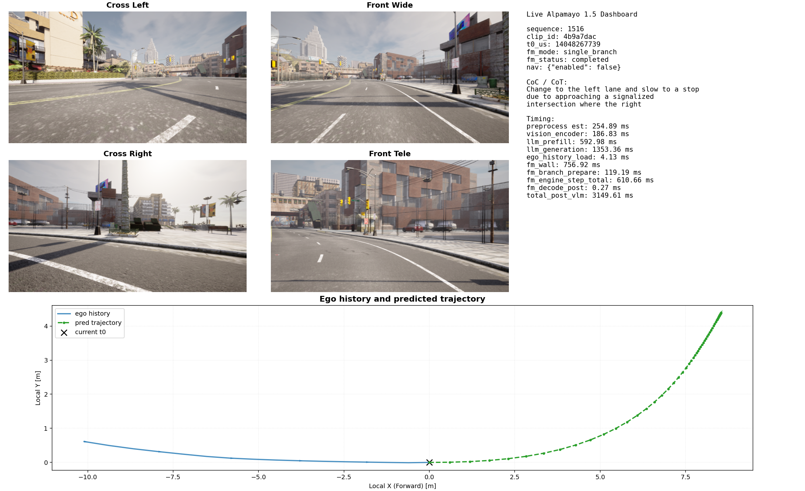

# Alpamayo VLM on TensorRT-Edge-LLM v0.6.0

This fork layers an Alpamayo 1.5 post-VLM trajectory stack on top of NVIDIA TensorRT-Edge-LLM v0.6.0.

The main additions are:
- native C++ post-VLM runtime for Alpamayo FM/action decoding
- FM one-step ONNX export entrypoint inside the repo
- live sample consumer for Alpamayo 1.5
- persistent `llm_inference` mode for reusing loaded engines across live requests

The original NVIDIA top-level README is preserved as [README_nvidia.md](README_nvidia.md).

## What This Fork Adds

Key custom files:
- `cpp/runtime/alpamayoFmRuntime.*`
- `cpp/runtime/alpamayoPostVlmRuntime.*`
- `cpp/common/deltaTrajectoryTokenizer.*`
- `cpp/common/npyUtils.*`
- `tensorrt_edgellm/onnx_export/fm_export.py`
- `tensorrt_edgellm/scripts/export_fm.py`
- `jetson_live_infer_alpamayo15.py`
- `scripts/run_live_chunk_udp_replay.py`
- `scripts/run_raw_dataset_one_shot_udp.py`
- `scripts/send_dummy_raw_action_udp.py`
- `planner_live/`

## CARLA Live Sample

Example live dashboard generated from a CARLA sample pull:



## Repository Layout

Important paths used in this fork:
- `examples/llm/llm_inference.cpp`: main inference binary with Alpamayo post-VLM hooks
- `jetson_live_infer_alpamayo15.py`: live HTTP sample consumer
- `input/requests/`: request JSON inputs
- `input/images/`, `input/ego/`: image and ego-history assets used by requests
- `output/`: runtime outputs, profiles, trajectories, dashboards

## Prerequisites

This fork assumes the standard TensorRT-Edge-LLM build prerequisites plus:
- TensorRT installation available through `TRT_PACKAGE_DIR`
- CUDA toolkit available through `CUDA_DIR` or `CUDA_CTK_VERSION`
- Alpamayo 1.5 Python source tree available separately for FM export
- prebuilt Alpamayo VLM TensorRT engines for the VLM stage

Typical engine layout used during development:
- LLM/backbone engine dir: `/workspace/models/alpamayo_runtime/engines/alpa1.5`
- visual FP8 multimodal engine dir: `/workspace/models/alpamayo_runtime/engines/alpa1.5_visual_fp8_rebuild`
- FM FP8 engine plan: `/workspace/models/alpamayo_runtime/fm/flowmatching_20260424_trt_fp8/engine_thor/teacher_structured_student_reflow_consistency_step4_mlp6144_one_step_fp8_s3328_thor.plan`

## Build

Standard CMake configure:

```bash
cd /root/TensorRT-Edge-LLM-v060
cmake -S . -B build \
  -DTRT_PACKAGE_DIR=/path/to/TensorRT \
  -DCUDA_CTK_VERSION=12.8
```

Build the inference binary:

```bash
cmake --build build --target llm_inference -j$(nproc)
```

Notes:
- the live Python runner expects the plugin library at `build/libNvInfer_edgellm_plugin.so`
- if you run the binary manually from outside the repo root, set `EDGELLM_PLUGIN_PATH` explicitly

Example:

```bash
export EDGELLM_PLUGIN_PATH=/root/TensorRT-Edge-LLM-v060/build/libNvInfer_edgellm_plugin.so
```

## Export FM ONNX

This fork includes an in-repo FM export CLI:

```bash
PYTHONPATH=/root/TensorRT-Edge-LLM-v060 python -m tensorrt_edgellm.scripts.export_fm \
  --model_dir /path/to/alpamayo/model \
  --alpamayo_src_dir /path/to/alpamayo1.5/src \
  --packet /path/to/replay_packet.pt \
  --output_dir /path/to/export_dir \
  --max_seq_len 8192 \
  --dtype fp16
```

Useful options:
- `--dtype {bf16,fp16}`
- `--check_only` to validate wrapper wiring without exporting ONNX

## Non-Live Inference

The integrated Alpamayo path is driven through `llm_inference`.

Minimal example:

```bash
./build/examples/llm/llm_inference \
  --engineDir /workspace/models/alpamayo_runtime/engines/alpa1.5 \
  --multimodalEngineDir /workspace/models/alpamayo_runtime/engines/alpa1.5_visual_fp8_rebuild \
  --fmEngine /workspace/models/alpamayo_runtime/fm/flowmatching_20260424_trt_fp8/engine_thor/teacher_structured_student_reflow_consistency_step4_mlp6144_one_step_fp8_s3328_thor.plan \
  --alpamayoPostVlmRuntime \
  --alpamayoFmUsePrefillKv \
  --inputFile /path/to/request_with_fm.json \
  --outputFile /tmp/alpamayo_output.json \
  --warmup 0
```

Optional flags:
- `--alpamayoFmUsePrefillKv` to feed backbone prefill KV directly into FM and skip CoT decode output
- `--alpamayoNavCfg` to enable guided/unguided nav CFG path
- `--dumpProfile` and `--profileOutputFile <path>` for single-shot timing dumps
- `--dumpKVCache` for KV cache export

The FM diffusion step count comes from the request JSON. The current no-nav replay and live wrappers default to `diffusion_num_steps=2`; pass `--diffusion-num-steps <N>` to the Python request builders when a different FM step count is needed.

## Prefill-KV FM Fast Path

The fast path added for Alpamayo FM reuses the backbone prefill KV directly as the FM input cache. This avoids generating the intermediate CoT text before FM; decode still runs for the FM/action expert output.

Use the C++ flag when invoking `llm_inference` directly:

```bash
--alpamayoFmUsePrefillKv
```

Use the Python wrapper flag everywhere else:

```bash
--alpamayo-fm-use-prefill-kv
```

The Python flag is wired through:
- `jetson_live_infer_alpamayo15.py`
- `scripts/run_request_bank_persistent.py`
- `scripts/run_live_chunk_udp_replay.py`
- `scripts/run_live_chunk_udp_precompute_replay.py`
- `scripts/run_raw_dataset_one_shot_udp.py`
- `scripts/run_live_chunk_oracle_nav_batch.sh`
- `planner_live.planner_live_service`

## Live Inference

The live consumer polls an HTTP sample server that exposes Alpamayo-formatted NPZ payloads at `/latest`.

Basic run:

```bash
python /workspace/alpamayo_vlm/jetson_live_infer_alpamayo15.py \
  --server-url http://<sample-server>:8765 \
  --engine-dir /workspace/models/alpamayo_runtime/engines/alpa1.5 \
  --multimodal-engine-dir /workspace/models/alpamayo_runtime/engines/alpa1.5_visual_fp8_rebuild \
  --fm-engine /workspace/models/alpamayo_runtime/fm/flowmatching_20260424_trt_fp8/engine_thor/teacher_structured_student_reflow_consistency_step4_mlp6144_one_step_fp8_s3328_thor.plan \
  --diffusion-num-steps 2 \
  --alpamayo-fm-use-prefill-kv \
  --once
```

Recommended live mode:

```bash
python /workspace/alpamayo_vlm/jetson_live_infer_alpamayo15.py \
  --server-url http://<sample-server>:8765 \
  --engine-dir /workspace/models/alpamayo_runtime/engines/alpa1.5 \
  --multimodal-engine-dir /workspace/models/alpamayo_runtime/engines/alpa1.5_visual_fp8_rebuild \
  --fm-engine /workspace/models/alpamayo_runtime/fm/flowmatching_20260424_trt_fp8/engine_thor/teacher_structured_student_reflow_consistency_step4_mlp6144_one_step_fp8_s3328_thor.plan \
  --diffusion-num-steps 2 \
  --alpamayo-fm-use-prefill-kv \
  --persistent-llm-inference
```

Useful live flags:
- `--once`
- `--dump-profile`
- `--dump-kv-cache`
- `--nav-text "..."`
- `--dump-nav-dual-cache`
- `--persistent-llm-inference`
- `--alpamayo-fm-use-prefill-kv`

## UDP Replay

For a two-camera replay request bank using front wide plus front tele:

```bash
cd /workspace/alpamayo_vlm
python scripts/build_live_chunk_request_bank.py \
  --dataset-root /path/to/live_dataset \
  --chunk-id 1 \
  --output-root output/request_banks/chunk0001_front_front_tele \
  --camera-semantics front front_tele \
  --diffusion-num-steps 2
```

Run that bank through persistent `llm_inference`, publish the viewer dashboard, and optionally send UDP:

```bash
python scripts/run_live_chunk_udp_replay.py \
  --dataset-root /path/to/live_dataset \
  --chunk-id 1 \
  --request-bank-root output/request_banks/chunk0001_front_front_tele \
  --replay-mode latest_only \
  --engine-dir /workspace/models/alpamayo_runtime/engines/alpa1.5 \
  --multimodal-engine-dir /workspace/models/alpamayo_runtime/engines/alpa1.5_visual_fp8_rebuild \
  --fm-engine /workspace/models/alpamayo_runtime/fm/flowmatching_20260424_trt_fp8/engine_thor/teacher_structured_student_reflow_consistency_step4_mlp6144_one_step_fp8_s3328_thor.plan \
  --alpamayo-fm-use-prefill-kv \
  --viewer-host 0.0.0.0 \
  --viewer-port 8780 \
  --udp-host 127.0.0.1 \
  --udp-port 5001
```

Add `--skip-udp` for local dashboard-only runs. `scripts/udp_replay_player.py` only resends an already-saved plan bank over UDP, so it has no model inference flags.

For the oracle-nav batch wrapper, pass the same fast-path flag:

```bash
bash scripts/run_live_chunk_oracle_nav_batch.sh --alpamayo-fm-use-prefill-kv
```

## Planner Live

The planner-container live service also supports the same prefill-KV option and can bridge each latest planner result to UDP.

Current control-team live UDP example:

```bash
cd /workspace/alpamayo_vlm
PYTHONPATH=/workspace/alpamayo_vlm python -m planner_live.planner_live_service \
  --server-url http://127.0.0.1:18080 \
  --sample-endpoint /latest \
  --timeout 2.0 \
  --poll-interval 0.05 \
  --engine-dir /workspace/models/alpamayo_runtime/engines/alpa1.5 \
  --multimodal-engine-dir /workspace/models/alpamayo_runtime/engines/alpa1.5_visual_fp8_rebuild \
  --fm-engine /workspace/models/alpamayo_runtime/fm/flowmatching_20260424_trt_fp8/engine_thor/teacher_structured_student_reflow_consistency_step4_mlp6144_one_step_fp8_s3328_thor.plan \
  --diffusion-num-steps 2 \
  --alpamayo-fm-use-prefill-kv \
  --enable-udp-bridge \
  --udp-host 10.179.113.253 \
  --udp-port 5005 \
  --udp-payload-mode text_json \
  --udp-full-plan \
  --udp-send-mode on_result
```

Open the live viewer at:

```text
http://localhost:8780/viewer
```

Useful UDP live flags:
- `--udp-payload-mode text_json` sends the control-team JSON payload instead of compact binary ALPA packets.
- `--udp-full-plan` sends the full decoded plan instead of a short resampled control window.
- `--udp-send-mode on_result` sends once whenever a new inference result is ready.
- `--quiet-llm-logs` is enabled by default and suppresses most C++ runtime logs.
- `--udp-action-log-interval-s 3.0` prints a throttled preview of the first action values.

Current `text_json` payload shape:

```json
{
  "raw_action": {
    "accel_mps2": [0.0, 0.0],
    "curvature": [0.0, 0.0]
  },
  "pred_xyz": [[0.0, 0.0, 0.0], [0.1, 0.0, 0.0]],
  "pred_yaw_rad": [0.0, 0.0],
  "pred_v_mps": [0.0, 0.0],
  "plan_dt_s": 0.1,
  "inference_time_s": 0.5
}
```

Control-team compatibility notes:
- `raw_action.curvature` is decoded from FM `x_final` and sign-flipped before UDP send to match the current comma/control convention.
- `raw_action.accel_mps2` is intentionally kept for schema compatibility, but currently carries velocity in `m/s`, not acceleration. The original decoded acceleration is kept in `raw_action.raw_accel_mps2` in the richer live payload.
- `plan_dt_s` is the spacing between action points, usually `0.1`.
- `inference_time_s` should be used by the receiver to time-align the plan when latency matters.
- Alpamayo path fields use local ego coordinates. The control side is responsible for any additional frame conversion it needs.

## Dummy UDP Sender

For bench-testing the receiver without running the model, edit:

```text
config/dummy_raw_action_udp.yaml
```

Then run:

```bash
cd /workspace/alpamayo_vlm
python scripts/send_dummy_raw_action_udp.py --config config/dummy_raw_action_udp.yaml
```

Send one packet only:

```bash
python scripts/send_dummy_raw_action_udp.py --config config/dummy_raw_action_udp.yaml --once
```

Dry-run without UDP:

```bash
python scripts/send_dummy_raw_action_udp.py --config config/dummy_raw_action_udp.yaml --dry-run
```

The dummy sender repeats the configured `accel_mps2` and `curvature` values for all 64 points and defaults `inference_time_s` to `0.3`.

The live consumer writes:
- run outputs: `output/runs/live_runtime/`
- trajectories: `output/trajectories/live_runtime/`
- dashboards: `output/dashboards/live_runtime/`
- optional nav cache dumps: `output/nav_cache/live_runtime/`

## Persistent `llm_inference` Mode

This fork adds `--persistentServer` to `llm_inference`.

In this mode the binary:
- loads engines once
- keeps runtime state alive
- reads newline-delimited JSON commands from `stdin`

Request command:

```json
{"input_file":"/path/request.json","output_file":"/path/output.json"}
```

Shutdown command:

```json
{"command":"shutdown"}
```

Current limitation:
- persistent mode disables per-request profile export through `--dumpProfile` / `--profileOutputFile`

## Input Expectations

The live consumer expects an NPZ sample containing:
- `image_frames`
- `camera_indices`
- `ego_history_xyz`
- `ego_history_rot`
- `relative_timestamps`
- `absolute_timestamps`
- `t0_us`
- `fixed_delta_seconds`
- `clip_id`
- `camera_order`

Shapes used by the live path:
- `image_frames`: `[Cam, T, C, H, W]`
- `ego_history_xyz`: `[1, 1, 16, 3]`
- `ego_history_rot`: `[1, 1, 16, 3, 3]`

## Known Limitations

- persistent server mode currently does not emit per-request profiler JSON
- this repo does not include the external Alpamayo 1.5 source tree; FM export expects `--alpamayo_src_dir`
- live mode is designed around an external sample server and does not include the producer implementation in this repo

## Upstream Documentation

For the original TensorRT-Edge-LLM overview, installation guide, and supported-platform matrix, see [README_nvidia.md](README_nvidia.md) and the upstream NVIDIA documentation linked there.
