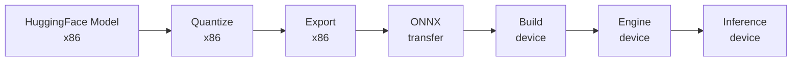

# Examples and Complete Workflows

> **Code Location:** `examples/` | **Build:** `examples/llm/`, `examples/multimodal/`

## Overview

This guide provides complete end-to-end workflows for using TensorRT Edge-LLM, covering model export, engine building, and inference execution. Each workflow demonstrates the complete pipeline from HuggingFace models to deployed inference with standardized folder structures.

> **⚠️ USER RESPONSIBILITY**: Users are responsible for composing meaningful and appropriate prompts for their use cases. The examples provided demonstrate technical usage patterns but do not guarantee output quality or appropriateness.

> **Prerequisites:** Complete the [Installation Guide](installation.md) for both x86 host and edge device before proceeding.

---

## Complete Workflow Summary

> **Note:** Each example shows complete commands including environment variable setup (`WORKSPACE_DIR`, `MODEL_NAME`). These variables persist in your shell session, so you only need to set them once per session.

Every TensorRT Edge-LLM deployment follows this pattern:



**Pipeline Stages:**
1. **Quantize (x86 Host)**: Quantize model to target precision (FP8/FP4)
2. **Export (x86 Host)**: Convert quantized model to ONNX format
3. **Transfer**: Copy ONNX models to edge device
4. **Build (Edge Device)**: Compile ONNX into optimized TensorRT engines
5. **Inference (Edge Device)**: Run inference using compiled engines

---

## Example 1: VLM (Vision-Language Model) Inference

Complete workflow for vision-language models with image understanding capabilities.

**Model:** Qwen2.5-VL-3B-Instruct

### Step 1: Quantize and Export (x86 Host)

```bash
export WORKSPACE_DIR=$HOME/tensorrt-edgellm-workspace
export MODEL_NAME=Qwen2.5-VL-3B-Instruct
mkdir -p $WORKSPACE_DIR
cd $WORKSPACE_DIR

# Quantize language model
tensorrt-edgellm-quantize-llm \
  --model_dir Qwen/Qwen2.5-VL-3B-Instruct \
  --quantization fp8 \
  --output_dir $MODEL_NAME/quantized

# Export language model
tensorrt-edgellm-export-llm \
  --model_dir $MODEL_NAME/quantized \
  --output_dir $MODEL_NAME/onnx/llm

# Export visual encoder
tensorrt-edgellm-export-visual \
  --model_dir Qwen/Qwen2.5-VL-3B-Instruct \
  --output_dir $MODEL_NAME/onnx/visual
```

### Step 2: Transfer to Device

```bash
# Transfer ONNX to device
scp -r $MODEL_NAME/onnx \
  <device_user>@<device_ip>:~/tensorrt-edgellm-workspace/$MODEL_NAME/
```

### Step 3: Build Engines (Thor Device)

```bash
# Set up workspace directory on device
export WORKSPACE_DIR=$HOME/tensorrt-edgellm-workspace
export MODEL_NAME=Qwen2.5-VL-3B-Instruct
cd ~/TensorRT-Edge-LLM

# Build language model engine
./build/examples/llm/llm_build \
  --onnxDir $WORKSPACE_DIR/$MODEL_NAME/onnx/llm \
  --engineDir $WORKSPACE_DIR/$MODEL_NAME/engines/llm \
  --maxBatchSize 1 \
  --maxInputLen 1024 \
  --maxKVCacheCapacity 4096

# Build visual encoder engine
./build/examples/multimodal/visual_build \
  --onnxDir $WORKSPACE_DIR/$MODEL_NAME/onnx/visual \
  --engineDir $WORKSPACE_DIR/$MODEL_NAME/engines/visual \
  --minImageTokens 128 \
  --maxImageTokens 512 \
  --maxImageTokensPerImage 512
```

Build time: ~10-15 minutes total

### Step 4: Run Inference (Thor Device)

Create an input file `$WORKSPACE_DIR/input_vlm.json` (replace `/path/to/image.jpg` with an actual image file path):

```json
{
    "batch_size": 1,
    "temperature": 1.0,
    "top_p": 1.0,
    "top_k": 50,
    "max_generate_length": 128,
    "requests": [
        {
            "messages": [
                {
                    "role": "system",
                    "content": "You are a helpful assistant."
                },
                {
                    "role": "user",
                    "content": [
                        {
                            "type": "image",
                            "image": "/path/to/image.jpg"
                        },
                        {
                            "type": "text",
                            "text": "Please describe the image."
                        }
                    ]
                }
            ]
        }
    ]
}
```

Run inference:

```bash
cd ~/TensorRT-Edge-LLM

./build/examples/llm/llm_inference \
  --engineDir $WORKSPACE_DIR/$MODEL_NAME/engines/llm \
  --multimodalEngineDir $WORKSPACE_DIR/$MODEL_NAME/engines/visual \
  --inputFile $WORKSPACE_DIR/input_vlm.json \
  --outputFile $WORKSPACE_DIR/output_vlm.json
```

**Success!** 🎉 Check `output_vlm.json` for vision-language model responses.

---

## Example 2: LLM EAGLE Speculative Decoding

EAGLE (Extrapolation Algorithm for Greater Language-model Efficiency) uses a smaller draft model to accelerate generation for text-only models.

**Model:** Llama-3.1-8B-Instruct with [EAGLE draft model](https://huggingface.co/yuhuili/EAGLE-LLaMA3.1-Instruct-8B)

### Step 1: Quantize and Export (x86 Host)

```bash
export MODEL_NAME=Llama-3.1-8B-Instruct
cd $WORKSPACE_DIR

# Download EAGLE draft model to workspace
git clone https://huggingface.co/yuhuili/EAGLE3-LLaMA3.1-Instruct-8B
cd EAGLE3-LLaMA3.1-Instruct-8B && git lfs pull && cd ..

# Quantize base model
tensorrt-edgellm-quantize-llm \
  --model_dir meta-llama/Llama-3.1-8B-Instruct \
  --quantization fp8 \
  --output_dir $MODEL_NAME/quantized-base

# Export base model with EAGLE flag
tensorrt-edgellm-export-llm \
  --model_dir $MODEL_NAME/quantized-base \
  --output_dir $MODEL_NAME/onnx/base \
  --is_eagle_base

# Quantize draft model
tensorrt-edgellm-quantize-draft \
  --base_model_dir meta-llama/Llama-3.1-8B-Instruct \
  --draft_model_dir EAGLE3-LLaMA3.1-Instruct-8B \
  --quantization fp8 \
  --output_dir $MODEL_NAME/quantized-draft

# Export draft model
tensorrt-edgellm-export-draft \
  --draft_model_dir $MODEL_NAME/quantized-draft \
  --base_model_dir meta-llama/Llama-3.1-8B-Instruct \
  --output_dir $MODEL_NAME/onnx/draft
```

### Step 2: Transfer to Device

```bash
# Transfer ONNX to device
scp -r $MODEL_NAME/onnx \
  <device_user>@<device_ip>:~/tensorrt-edgellm-workspace/$MODEL_NAME/
```

### Step 3: Build Engines (Thor Device)

```bash
export WORKSPACE_DIR=$HOME/tensorrt-edgellm-workspace
export MODEL_NAME=Llama-3.1-8B-Instruct
cd ~/TensorRT-Edge-LLM

# Build base model EAGLE engine
./build/examples/llm/llm_build \
  --onnxDir $WORKSPACE_DIR/$MODEL_NAME/onnx/base \
  --engineDir $WORKSPACE_DIR/$MODEL_NAME/engines \
  --maxBatchSize 1 \
  --maxInputLen 1024 \
  --maxKVCacheCapacity 4096 \
  --maxVerifyTreeSize 60 \
  --maxDraftTreeSize 60 \
  --eagleBase

# Build draft model engine
./build/examples/llm/llm_build \
  --onnxDir $WORKSPACE_DIR/$MODEL_NAME/onnx/draft \
  --engineDir $WORKSPACE_DIR/$MODEL_NAME/engines \
  --maxBatchSize 1 \
  --maxInputLen 1024 \
  --maxKVCacheCapacity 4096 \
  --maxVerifyTreeSize 60 \
  --maxDraftTreeSize 60 \
  --eagleDraft
```

Build time: ~15-20 minutes total

### Step 4: Run Inference (Thor Device)

```bash
cd ~/TensorRT-Edge-LLM

./build/examples/llm/llm_inference \
  --engineDir $WORKSPACE_DIR/$MODEL_NAME/engines \
  --inputFile $WORKSPACE_DIR/input.json \
  --outputFile $WORKSPACE_DIR/output.json \
  --eagle
```

**Note:** EAGLE speculative decoding provides 1.5-3x faster generation but is limited to batch size 1.

---

## Example 3: VLM EAGLE Speculative Decoding

EAGLE for vision-language models combines accelerated text generation with image understanding.

**Model:** Qwen2.5-VL-7B-Instruct with [EAGLE3 draft model](https://huggingface.co/Rayzl/qwen2.5-vl-7b-eagle3-sgl)

### Step 1: Quantize and Export (x86 Host)

```bash
export MODEL_NAME=Qwen2.5-VL-7B-Instruct
cd $WORKSPACE_DIR

# Download EAGLE draft model to workspace
git clone https://huggingface.co/Rayzl/qwen2.5-vl-7b-eagle3-sgl
cd qwen2.5-vl-7b-eagle3-sgl && git lfs pull && cd ..

# Quantize base model
tensorrt-edgellm-quantize-llm \
  --model_dir Qwen/Qwen2.5-VL-7B-Instruct \
  --quantization fp8 \
  --output_dir $MODEL_NAME/quantized-base

# Export base model with EAGLE flag
tensorrt-edgellm-export-llm \
  --model_dir $MODEL_NAME/quantized-base \
  --output_dir $MODEL_NAME/onnx/base \
  --is_eagle_base

# Quantize draft model
tensorrt-edgellm-quantize-draft \
  --base_model_dir Qwen/Qwen2.5-VL-7B-Instruct \
  --draft_model_dir qwen2.5-vl-7b-eagle3-sgl \
  --quantization fp8 \
  --output_dir $MODEL_NAME/quantized-draft

# Export draft model
tensorrt-edgellm-export-draft \
  --draft_model_dir $MODEL_NAME/quantized-draft \
  --base_model_dir Qwen/Qwen2.5-VL-7B-Instruct \
  --output_dir $MODEL_NAME/onnx/draft

# Export visual encoder
tensorrt-edgellm-export-visual \
  --model_dir Qwen/Qwen2.5-VL-7B-Instruct \
  --output_dir $MODEL_NAME/onnx/visual
```

### Step 2: Transfer to Device

```bash
# Transfer ONNX to device
scp -r $MODEL_NAME/onnx \
  <device_user>@<device_ip>:~/tensorrt-edgellm-workspace/$MODEL_NAME/
```

### Step 3: Build Engines (Thor Device)

```bash
export WORKSPACE_DIR=$HOME/tensorrt-edgellm-workspace
export MODEL_NAME=Qwen2.5-VL-7B-Instruct
cd ~/TensorRT-Edge-LLM

# Build base model EAGLE engine
./build/examples/llm/llm_build \
  --onnxDir $WORKSPACE_DIR/$MODEL_NAME/onnx/base \
  --engineDir $WORKSPACE_DIR/$MODEL_NAME/engines/llm \
  --maxBatchSize 1 \
  --maxInputLen 1024 \
  --maxKVCacheCapacity 4096 \
  --maxVerifyTreeSize 60 \
  --maxDraftTreeSize 60 \
  --eagleBase

# Build draft model engine
./build/examples/llm/llm_build \
  --onnxDir $WORKSPACE_DIR/$MODEL_NAME/onnx/draft \
  --engineDir $WORKSPACE_DIR/$MODEL_NAME/engines/llm \
  --maxBatchSize 1 \
  --maxInputLen 1024 \
  --maxKVCacheCapacity 4096 \
  --maxVerifyTreeSize 60 \
  --maxDraftTreeSize 60 \
  --eagleDraft

# Build visual encoder engine
./build/examples/multimodal/visual_build \
  --onnxDir $WORKSPACE_DIR/$MODEL_NAME/onnx/visual \
  --engineDir $WORKSPACE_DIR/$MODEL_NAME/engines/visual \
  --minImageTokens 128 \
  --maxImageTokens 512 \
  --maxImageTokensPerImage 512
```

Build time: ~20-30 minutes total

### Step 4: Run Inference (Thor Device)

```bash
cd ~/TensorRT-Edge-LLM

./build/examples/llm/llm_inference \
  --engineDir $WORKSPACE_DIR/$MODEL_NAME/engines/llm \
  --multimodalEngineDir $WORKSPACE_DIR/$MODEL_NAME/engines/visual \
  --inputFile $WORKSPACE_DIR/input.json \
  --outputFile $WORKSPACE_DIR/output.json \
  --eagle
```

**Success!** 🎉 EAGLE VLM provides accelerated multimodal inference.

---

## Example 4: LoRA-Enabled Models

Dynamic LoRA adapter support allows switching between fine-tuned adapters at runtime without rebuilding engines.

**Model:** Qwen2.5-0.5B-Instruct with LoRA adapter

### Step 1: Export and Process (x86 Host)

```bash
export MODEL_NAME=Qwen2.5-0.5B-Instruct
cd $WORKSPACE_DIR

# Export base model (FP16, no quantization needed for small model)
tensorrt-edgellm-export-llm \
  --model_dir Qwen/Qwen2.5-0.5B-Instruct \
  --output_dir $MODEL_NAME/onnx

# Insert LoRA support into ONNX
tensorrt-edgellm-insert-lora \
  --onnx_dir $MODEL_NAME/onnx

# Download and process LoRA adapter
git clone https://huggingface.co/madhurjindal/Jailbreak-Detector-2-XL
cd Jailbreak-Detector-2-XL && git lfs pull && cd ..

# Process LoRA weights
tensorrt-edgellm-process-lora \
  --input_dir Jailbreak-Detector-2-XL \
  --output_dir $MODEL_NAME/onnx/lora_weights/jailbreak_detector
```

### Step 2: Transfer to Device

```bash
# Transfer ONNX and LoRA weights to device
scp -r $MODEL_NAME/onnx \
  <device_user>@<device_ip>:~/tensorrt-edgellm-workspace/$MODEL_NAME/
```

### Step 3: Build Engine (Thor Device)

```bash
export WORKSPACE_DIR=$HOME/tensorrt-edgellm-workspace
export MODEL_NAME=Qwen2.5-0.5B-Instruct
cd ~/TensorRT-Edge-LLM

# Build engine with LoRA support
./build/examples/llm/llm_build \
  --onnxDir $WORKSPACE_DIR/$MODEL_NAME/onnx \
  --engineDir $WORKSPACE_DIR/$MODEL_NAME/engines \
  --maxBatchSize 1 \
  --maxInputLen 1024 \
  --maxKVCacheCapacity 4096 \
  --maxLoraRank 64
```

### Step 4: Run Inference (Thor Device)

```bash
cd ~/TensorRT-Edge-LLM

./build/examples/llm/llm_inference \
  --engineDir $WORKSPACE_DIR/$MODEL_NAME/engines \
  --inputFile $WORKSPACE_DIR/input.json \
  --outputFile $WORKSPACE_DIR/output.json
```

**Note:** You can add multiple LoRA adapters to the `lora_weights/` directory and switch between them at runtime without rebuilding the engine.

---

## Example 5: Phi-4-Multimodal with LoRA Merge

Phi-4-Multimodal requires merging vision LoRA adapter into the base model before quantization and export.

**Model:** Phi-4-multimodal-instruct

### Step 1: Merge, Quantize, and Export (x86 Host)

```bash
export MODEL_NAME=Phi-4-multimodal-instruct
cd $WORKSPACE_DIR

# Clone Phi-4-multimodal-instruct from HuggingFace
git clone https://huggingface.co/microsoft/Phi-4-multimodal-instruct
cd Phi-4-multimodal-instruct && git lfs pull && cd ..

# Merge vision LoRA adapter into base model
tensorrt-edgellm-merge-lora \
  --model_dir Phi-4-multimodal-instruct \
  --lora_dir Phi-4-multimodal-instruct/vision-lora \
  --output_dir $MODEL_NAME/merged

# Quantize merged model
tensorrt-edgellm-quantize-llm \
  --model_dir $MODEL_NAME/merged \
  --output_dir $MODEL_NAME/quantized \
  --quantization nvfp4

# Export language model
tensorrt-edgellm-export-llm \
  --model_dir $MODEL_NAME/quantized \
  --output_dir $MODEL_NAME/onnx/llm

# Export visual encoder (use original weights, not merged)
tensorrt-edgellm-export-visual \
  --model_dir Phi-4-multimodal-instruct \
  --output_dir $MODEL_NAME/onnx/visual
```

### Step 2: Transfer to Device

```bash
# Transfer ONNX to device
scp -r $MODEL_NAME/onnx \
  <device_user>@<device_ip>:~/tensorrt-edgellm-workspace/$MODEL_NAME/
```

### Step 3: Build Engines (Thor Device)

```bash
export WORKSPACE_DIR=$HOME/tensorrt-edgellm-workspace
export MODEL_NAME=Phi-4-multimodal-instruct
cd ~/TensorRT-Edge-LLM

# Build language model engine
./build/examples/llm/llm_build \
  --onnxDir $WORKSPACE_DIR/$MODEL_NAME/onnx/llm \
  --engineDir $WORKSPACE_DIR/$MODEL_NAME/engines/llm \
  --maxBatchSize 1 \
  --maxInputLen 1024 \
  --maxKVCacheCapacity 4096

# Build visual encoder engine
./build/examples/multimodal/visual_build \
  --onnxDir $WORKSPACE_DIR/$MODEL_NAME/onnx/visual \
  --engineDir $WORKSPACE_DIR/$MODEL_NAME/engines/visual \
  --minImageTokens 128 \
  --maxImageTokens 512 \
  --maxImageTokensPerImage 512
```

### Step 4: Run Inference (Thor Device)

```bash
cd ~/TensorRT-Edge-LLM

./build/examples/llm/llm_inference \
  --engineDir $WORKSPACE_DIR/$MODEL_NAME/engines/llm \
  --multimodalEngineDir $WORKSPACE_DIR/$MODEL_NAME/engines/visual \
  --inputFile $WORKSPACE_DIR/input.json \
  --outputFile $WORKSPACE_DIR/output.json
```

**Success!** 🎉 Phi-4-Multimodal with merged vision adapter running on edge device.

---

## Input File Format Reference

All examples in this guide use standardized JSON input files. For complete input format specification including all parameters, multi-turn conversations, LoRA adapters, and advanced features, see the **[Input Format Guide](input-format.md)**.

---

## Common Build Parameters

### LLM Build Parameters (`llm_build`)

| Parameter | Description | Default | Used In |
|-----------|-------------|---------|---------|
| `--onnxDir` | Input ONNX directory | Required | All |
| `--engineDir` | Output engine directory | Required | All |
| `--maxBatchSize` | Maximum batch size | 4 | All |
| `--maxInputLen` | Maximum input length | 1024 | All |
| `--maxKVCacheCapacity` | Maximum KV-cache capacity (sequence length) | 4096 | All |
| `--maxLoraRank` | Maximum LoRA rank (0=disabled) | 0 | LoRA models |
| `--maxVerifyTreeSize` | Max verify tree size | 60 | EAGLE only |
| `--maxDraftTreeSize` | Max draft tree size | 60 | EAGLE only |
| `--eagleBase` | Build EAGLE base model | false | EAGLE only |
| `--eagleDraft` | Build EAGLE draft model | false | EAGLE only |
| `--debug` | Enable debug logging | false | Optional |

### Visual Build Parameters (`visual_build`)

| Parameter | Description | Default |
|-----------|-------------|---------|
| `--onnxDir` | Input ONNX directory | Required |
| `--engineDir` | Output engine directory | Required |
| `--minImageTokens` | Minimum image tokens | 4 |
| `--maxImageTokens` | Maximum image tokens | 1024 |
| `--maxImageTokensPerImage` | Max tokens per image | 512 |
| `--debug` | Enable debug logging | false |

### Inference Parameters (`llm_inference`)

| Parameter | Description | Used In |
|-----------|-------------|---------|
| `--engineDir` | Engine directory (required) | All |
| `--multimodalEngineDir` | Visual/draft engine directory | VLM/EAGLE |
| `--inputFile` | Input JSON path (required) | All |
| `--outputFile` | Output JSON path | All |
| `--eagle` | Enable EAGLE speculative decoding | EAGLE only |
| `--eagleDraftTopK` | Tokens selected per drafting step | EAGLE (default: 10) |
| `--eagleDraftStep` | Number of drafting steps | EAGLE (default: 6) |
| `--eagleVerifyTreeSize` | Tokens for verification | EAGLE (default: 60) |
| `--batchSize` | Override batch size from input file | Optional |
| `--maxGenerateLength` | Override max generate length | Optional |
| `--dumpProfile` | Enable profiling output | Optional |
| `--profileOutputFile` | Profile output path | Optional |
| `--warmup` | Number of warmup runs | Optional (default: 0) |
| `--debug` | Enable debug logging | Optional |

**Note:** Sampling parameters (temperature, top_p, top_k) are specified in the input JSON file, not as command-line arguments.

---

## Profiling and Performance Analysis

Enable profiling to measure inference performance:

```bash
cd ~/TensorRT-Edge-LLM

./build/examples/llm/llm_inference \
  --engineDir $WORKSPACE_DIR/$MODEL_NAME/engines \
  --inputFile $WORKSPACE_DIR/input.json \
  --outputFile $WORKSPACE_DIR/output.json \
  --dumpProfile \
  --profileOutputFile $WORKSPACE_DIR/profile.json
```

The profile output includes:
- Per-token latency
- Prefill time
- Generation time
- KV-cache usage
- Memory allocation statistics
